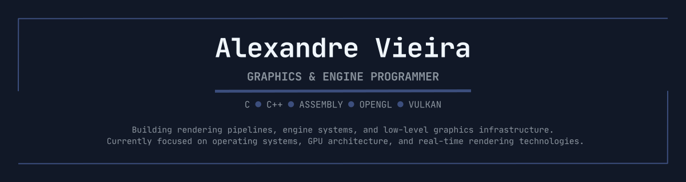
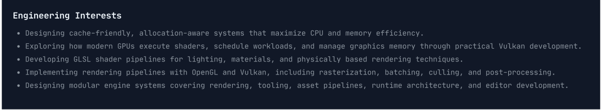

---

---

<h3 align="left">Graphics & Systems Projects</h3>

Projects that support my long-term goal of becoming a graphics and engine programmer.

| Project | Repository | Status | Description |
|:--------|:----------:|:------:|:------------|
| [**AtlasDS**](https://github.com/avieira-dev/atlas-ds.git) | Public | **Active Development** | Collection of fundamental data structures implemented in pure C, emphasizing memory layout, cache efficiency, and reusable low-level abstractions. |
| [**Software Rasterizer**](https://github.com/avieira-dev/software-rasterizer.git) | Public | **Active Development** | CPU-based graphics pipeline implemented from scratch in modern C++, exploring rasterization, clipping, interpolation, and rendering algorithms. |
| **InteractUI** | Private | **Planning** | Immediate-mode GUI framework for C++, designed for engine editors and high-performance applications. |
| **Ptah** | Private | **Planning** | Modular cross-platform game engine focused on rendering architecture, tooling, asset pipelines, runtime systems, and editor development. |
| **Drawxel** | Private | **Planning** | Pixel art and sprite animation editor emphasizing performance, precision, and efficient content creation. |
| **Ada** | Private | **Planning** | Educational x86-64 operating system kernel written in C and Assembly, exploring memory management, interrupts, privilege levels, and hardware abstraction. |

---

<h3 align="left">Developer Tools</h3>

Utilities built to improve my own development workflow and productivity.

| Project | Repository | Status | Description |
|:--------|:----------:|:------:|:------------|
| [**mkproj**](https://github.com/avieira-dev/mkproj-cli.git) | Public | **Stable** | CLI utility for generating project structures from predefined templates. |
| [**ctxgen**](https://github.com/avieira-dev/ctxgen.git) | Public | **Stable** | Command-line tool that bundles source code into a single text file for documentation, AI workflows, and code sharing. |
| [**binconv**](https://github.com/avieira-dev/binconv.git) | Public | **Active Development** | Command-line utility for converting numbers between decimal, binary, hexadecimal, and other numeral systems. |
| **akangatu** | Private | **Planning** | Local filesystem auditing tool that tracks and organizes workspace evolution over time. |

---

<h3 align="left">Current Learning</h3>

- Modern OpenGL
- Vulkan
- Computer Graphics
- GPU Architecture & Memory Management
- Engine Architecture
- Operating System Development

---

<h3 align="left">Long-Term Goal</h3>

Build deep expertise across the graphics software stack—from operating systems and GPU architecture to rendering pipelines and engine development. My long-term objective is to design and implement the low-level technologies that power interactive graphics, whether in proprietary engines, graphics runtimes, or operating system components.

---

<h3 align="left">Technologies & Tools</h3>

<h4 align="left">Languages</h4>

    
    
    

<h4 align="left">Graphics</h4>

    
    

<h4 align="left">Systems</h4>

    

<h4 align="left">Tools</h4>

    
    
    

<h4 align="left">Workflow & Tooling</h4>

<em>Languages and tools that support my development workflow.</em>

    

<h4 align="left">Exploring</h4>

<em>Expanding into adjacent tools and ecosystems.</em>

    
    
    

---

<h3 align="left">Connect</h3>

    

